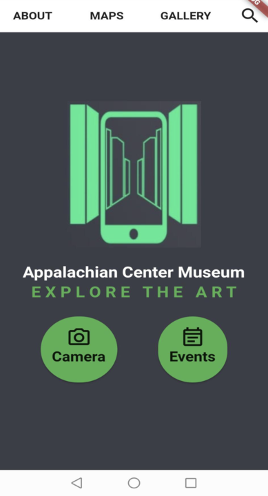

# Appalachian-Center-Museum-APP
Object Detection application for the Appalachian Center Museum Berea College

# Demo
Welcome to the demo section of our innovative Android/iOS application built using Flutter, Google APIs, Firebase, and the powerful TensorFlow library. We've picked a range of simple objects in this initial demonstration to demonstrate the power of our picture recognition algorithm.

# Looking Ahead
As we continue to train our algorithm, we're preparing to integrate a large dataset comprising artworks. This comprehensive dataset will enrich the app's ability to recognize and offer insights into diverse art objects.

Stay tuned for future updates!
